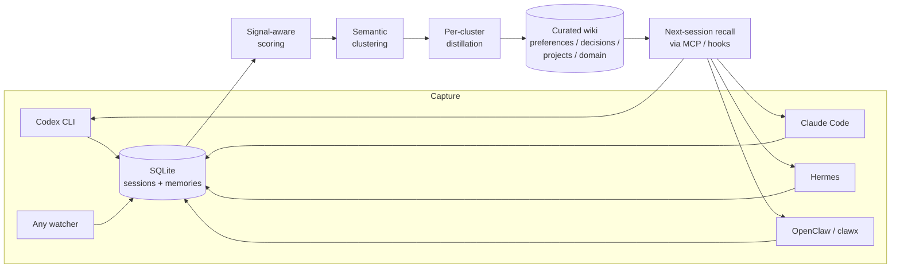

<div align="center">
  
</div>

# Loop Memory

> **A general-purpose, local-first memory system that closes the agent loop for every AI agent you run.**
>
> Point Loop Memory at any agent's transcript directory and it
> quietly catches every conversation, scores it, distils the long
> tail into a tight wiki of stable knowledge, and re-injects the
> relevant pieces into the next session. Out of the box: hooks for
> Codex, Claude, Hermes, and OpenClaw; an SDK + generic watcher
> CLI cover everything else.

[](https://github.com/smartfind/loop-memory/actions)
[](https://pypi.org/project/loop-memory/)
[](LICENSE)
[](docs/release.md)
[](https://pypi.org/project/loop-memory/)
[](pyproject.toml)

---

> **What's new in 0.4.9** — **OKF v0.2 export** + **bi-temporal `as_of` recall**. `loop-memory export-okf <dir>` writes an [Open Knowledge Format](https://github.com/okf/SPEC) v0.2 bundle — one `.md` file per wiki page with YAML frontmatter + an `index.md` index — so a Loop Memory store can be handed to any OKF-aware tool (Grep, Obsidian, akitaonrails/ai-memory, okf-agent-memory, ...) without re-parsing the body (audit 2026-09-20, Google OKF v0.2 spec + akitaonrails/ai-memory 2.0 + okf-memory/okf-agent-memory, all Apache-2.0/MIT, 2026-09-01 → 2026-09-06). `loop-memory recall <q> --as-of <ISO|epoch>` answers the bi-temporal question "what did we know about this query at that moment?" — a memory written after the moment is invisible, and a superseded memory walks its chain to find whether the invalidation had happened by then (audit 2026-09-20, loomcycle v1.33-v1.49 RFCs BL/BS/BU/BV/BW, Apache-2.0). Both shapes ship with HTTP routes (`POST /api/export/okf`, `GET /api/recall?as_of=...`). 34 new regression cases pin both shapes. [Full CHANGELOG →](./CHANGELOG.md#049---2026-09-20)

> **What's new in 0.4.8** — **L0 outline recall** +
> **per-agent identity bootstrap**. `loop-memory recall-paths <q>`
> (and the new `recall --outline` flag) returns only `id` +
> `abstract` + `score` + `why` for each hit — never the full
> body — so an agent can identify the top candidates cheaply
> before deciding which bodies to fetch (audit 2026-09-13,
> tigerless-labs/agent-memory v0.3.0 recall-ladder pattern).
> `loop-memory init --agent <name>` registers an agent in the
> new `agents` table and (with `--install-hooks`) also wires
> the MCP + SessionStart hooks for codex/claude/hermes; the
> index is bumped on every `install-hooks` run so a user can
> always answer "which CLIs are wired into this store?" with
> one SQL query (audit 2026-09-13, Mem0 CLI `init --agent`
> pattern). Both shapes ship with HTTP routes
> (`/api/recall/outline`, `/api/agents`, `/api/init/agent`).
> 57 new regression cases pin both shapes. [Full
> changelog →](CHANGELOG.md)
>
> **What's new in 0.4.7** — **per-memory lifetime stats** +
> **portable SQLite snapshot**. `loop-memory memory-stats <id>`
> returns a flat dict (recall_count, positive, negative, age,
> etc.) so you can ask "is anyone still using this memory?"
> without cracking open the SQLite file (audit 2026-09-06,
> agentmemory v1.3.0 pattern). `loop-memory snapshot <out>` /
> `loop-memory restore <in>` move a single-file, lossless
> snapshot of the entire store — including recall-quality
> signals and the supersession chain — to another machine
> (audit 2026-09-06, codexa-memory v0.2.0 pattern). Both shapes
> ship with HTTP routes (`/api/memories/{id}/stats`,
> `/api/snapshot`, `/api/snapshot/restore`). 33 new regression
> cases pin both shapes.
> [Full changelog →](CHANGELOG.md)

---

## Table of contents

- [What it does](#what-it-does)
- [Install](#install)
- [Quickstart](#quickstart)
- [Why Loop Memory vs. every other agent-memory project](#why-loop-memory-vs-every-other-agent-memory-project)
- [Architecture & docs](#architecture--docs)
- [After install: 30-second setup](#after-install-30-second-setup)
- [Auto-capture (after every conversation)](#auto-capture-after-every-conversation)
- [Dashboard + Evolution consolidator](#dashboard--evolution-consolidator-看板--进化式蒸馏)
- [Auto-feedback into every LLM client](#auto-feedback-into-every-llm-client-反哺)
- [Web UI](#web-ui)
- [Programmatic use](#programmatic-use)
- [The four-stage loop](#the-four-stage-loop)
- [Project layout](#project-layout)
- [Security & auth token](#security--auth-token)
- [Wiki scope auto-classification](#wiki-scope-auto-classification)
- [FAQ & troubleshooting](#faq--troubleshooting)
- [Run the tests](#run-the-tests)
- [Using distilled knowledge in your clients](#using-distilled-knowledge-in-your-clients)
- [License](#license)

---

## What it does

**Loop Memory** gives every agent you use a single, persistent brain
that outlives any one conversation. Any agent that drops transcripts
on disk — Codex CLI, Claude Code, Hermes, OpenClaw / clawx, Aider,
Cursor, … — works; the shipped hooks cover the popular ones and a
generic watcher CLI (`loop-memory hook --source <name> --watch <dir>`)
accepts anything else. Loop Memory quietly catches every fragment,
scores it by *importance × recency × usage × feedback*, distils the
long tail into a curated wiki, and re-injects the relevant pieces
into the next session.



*One loop, many agents, one evolving wiki.*

**Supported agents:**

| Agent          | Capture path                        | Hook shipped? | Notes |
| -------------- | ----------------------------------- | :-----------: | ----- |
| Codex CLI      | `~/.codex/sessions/*.json`          | ✅ | MCP + SessionStart auto-wired by `install-hooks` |
| Claude Code    | `~/.claude/**/*.jsonl`              | ✅ | MCP + SessionStart auto-wired by `install-hooks` |
| Hermes         | `~/.hermes/**/*.jsonl`              | ✅ | MCP + SessionStart auto-wired by `install-hooks` |
| OpenClaw/clawx | `~/.openclaw/agents/main/sessions` + `workspace/memory/*.md` | ✅ | watcher only (no MCP yet); `openclaw-setup` enables launchd |
| Anything else  | any on-disk transcript dir          | —             | use `loop-memory hook --source <name> --watch <dir>` (see [docs/auto-capture.md](docs/auto-capture.md)) |

The shipped hooks are the four popular agents we maintain in-tree.
The generic watcher CLI is the supported extension point for every
other agent — Aider, Cursor, Copilot, Cline, Continue, Goose, your
own home-grown CLI, anything that drops JSON/JSONL on disk.

---

## Install

```bash
pip install loop-memory                          # core: zero deps
pip install 'loop-memory[serve]'                  # + FastAPI web UI
pip install 'loop-memory[openai]'                 # + OpenAI client
pip install 'loop-memory[all]'                    # everything
```

---

## Quickstart

```bash
# 1. Import everything that already lives on your disk
loop-memory ingest codex          # ~/.codex/sessions/*.json
loop-memory ingest claude         # ~/.claude/**/*.jsonl
loop-memory ingest hermes         # ~/.hermes/**/*.jsonl

# 2. Look at it
loop-memory serve --port 7767     # open http://127.0.0.1:7767

# 3. Make it run on a timer
#    (see docs/auto-capture.md for launchd / systemd / cron snippets)
loop-memory consolidate          # rescore + GC + dedupe
```

---

## Why Loop Memory vs. every other agent-memory project

We surveyed the open-source memory systems for AI agents that came
up in 2026 (Mem0, Hindsight, OpenViking, A-MEM) and kept what worked.
Loop Memory is the smallest system that still ships *all* of the
following — every other project we looked at lacks at least one:

| Capability | **Loop Memory** | Mem0 v3 | Hindsight | OpenViking | A-MEM |
| --- | --- | --- | --- | --- | --- |
| Multi-source capture (any agent with on-disk transcripts) | ✅ generic watcher CLI; hooks shipped for Codex / Claude / Hermes / OpenClaw | ⚠ requires plugin per client | ⚠ hosted only | ⚠ SDK + companion app | ❌ |
| Local-first SQLite (zero external services) | ✅ | ❌ Postgres + Qdrant | ❌ Postgres + Qdrant | ⚠ file-system + cloud | ⚠ ChromaDB |
| Hybrid recall: BM25 + semantic + entity (RRF) | ✅ | ✅ | ✅ | ✅ | ⚠ entity-only |
| Temporal reasoning in retrieval (boost / suppress by date intent) | ✅ | ✅ | ❌ | ❌ | ❌ |
| Tiered loading L0/L1/L2 (titles / summary / body) | ✅ | ❌ | ❌ | ✅ | ❌ |
| Per-client wiki scope (global vs. source-specific) | ✅ | ⚠ user-level | ⚠ tenant-level | ❌ | ❌ |
| Distillation that prefers *completeness over compression* | ✅ | ✅ | ✅ | ✅ | ✅ |
| Distillation that runs on a schedule **and** on demand | ✅ both | ✅ schedule | ✅ both | ✅ schedule | ❌ |
| Knowledge graph (entities + relations) | ✅ light | ✅ Neo4j | ✅ | ✅ native graph | ✅ ChromaDB |
| Cognitive sleep with auditable cleanup | ✅ v7 | ⚠ | ✅ | ⚠ | ❌ |
| Git-friendly `MEMORY.md` export / fork | ✅ v7 | ⚠ hosted | ⚠ | ✅ file-based | ❌ |
| Universal SDK + HTTP + MCP contract | ✅ v7 | ✅ | ⚠ | ✅ | ⚠ |
| OpenAI-compatible multi-provider LLM (incl. MiniMax) | ✅ | ✅ | ✅ | ✅ | ⚠ |
| Open-source, MIT, no hosted tier required | ✅ | ✅ (cloud SKUs dominant) | ✅ | ⚠ AGPLv3 | ✅ |

**The honest gap**: we don't have Mem0's hosted platform (managed
multi-tenant scaling, byte-benchmarked vector indexes), and we don't
ship OpenViking's companion desktop app. What we *do* ship is the
smallest set of moving parts that lets you run the same memory
loop across every locally-installed agent without sending your
transcripts anywhere.

If you want raw scale, Mem0's cloud SKU will beat us. If you want a
local-first single-user brain that every offline agent (Codex, Claude,
Hermes, clawx) can read and write, we built this for you.

---

## Architecture & docs

| Doc | What's in it |
| --- | --- |
| [docs/architecture.md](docs/architecture.md) | Layered view of the subpackages, the 5-stage evolution pipeline, the request lifecycle, and how secrets and settings are separated between the SQLite store and a local permission-restricted secrets file |
| [docs/api.md](docs/api.md) | HTTP API reference — every route, request body, and response shape the UI consumes |
| [docs/agent-memory-api.md](docs/agent-memory-api.md) | Stable four-verb SDK / HTTP / MCP contract for any Agent |
| [docs/universal-agent-memory.md](docs/universal-agent-memory.md) | v7 graph memory, cognitive sleep, portable bundles, namespaces, and MCP/CLI extensions |
| [docs/providers.md](docs/providers.md) | LLM provider reference — built-in providers, defaults, base URLs, and how to add a new one |
| [docs/auto-capture.md](docs/auto-capture.md) | Hooking Codex / Claude / Hermes / OpenClaw watchers (filesystem, launchd, systemd, cron) |
| [CONTRIBUTING.md](CONTRIBUTING.md) | Local dev loop, pytest, where secrets live, how to add a provider/source |
| [CHANGELOG.md](CHANGELOG.md) | Per-release notes |

The live interactive OpenAPI document is at `http://127.0.0.1:7767/docs`
once the server is running.

---


## After install: 30-second setup

```bash
# Show me what's installed, what's wired, what's broken.
loop-memory doctor

# Auto-configure MCP + SessionStart hooks for every detected CLI
# (Codex CLI, Claude Code, Hermes).
loop-memory install-hooks

# Install the openclaw/clawx auto-ingest watcher (launchd on macOS).
loop-memory openclaw-setup

# Run it on a schedule — web UI → ⚙ Model → set "every day 03:00".
loop-memory serve --port 7767   # → http://127.0.0.1:7767
```

The web UI also has a **🔍 Run doctor** panel under the kebab menu
(⌘D) that shows the same green/red diagnostic screen inline.

---

## Auto-capture (after every conversation)

A new conversation ends → its transcript file lands in a watched
directory → the watcher ingests it → it shows up in the UI. Three
flavors:

| Tool                       | Watch                                           |
| -------------------------- | ----------------------------------------------- |
| Codex CLI                  | `loop-memory hook --source codex  --watch ~/.codex/sessions`   |
| Claude Code                | `loop-memory hook --source claude --watch ~/.claude`           |
| Hermes                     | `loop-memory hook --source hermes --watch ~/.hermes`           |
| OpenClaw (clawx)           | `loop-memory hook --source openclaw --watch ~/.openclaw/agents/main/sessions` — also ingests `workspace/memory/*.md` daily logs |
| Anything else (Aider, Cursor, Copilot, Cline, Continue, Goose, …) | `loop-memory hook --source <name> --watch <path/to/transcripts>` — see [docs/auto-capture.md](docs/auto-capture.md) for loader requirements |

Three of these in a `tmux` session, or persisted via launchd, keeps
your memory store fresh without any clicks. Run `loop-memory
consolidate` on an hourly cron to keep the scoring healthy.

See [docs/auto-capture.md](docs/auto-capture.md) for ready-to-paste
launchd + systemd + cron snippets.
---

## Dashboard + Evolution consolidator (看板 + 进化式蒸馏)

The Dashboard tab gives you a live, at-a-glance view of the memory
pipeline and lets you steer it.

- **4 KPI cards** — raw memory count, distilled wiki count, average
  score, total recall events (real-time, auto-refresh every 8s).
- **5-stage data-flow animation** — score → cluster → distill → wiki
  → memo. Click any node to drill into the items that flowed through
  it last run. The wave path on top pulses to suggest motion; nodes
  pulse on hover.
- **Drill-down panel** — every item has 👍 / 👎 buttons that feed the
  evolution loop. Negative feedback lowers the memory's importance;
  positive bumps it. Both update the "most recalled memories" list.
- **Evolution run button** — invokes the 5-stage Evolution
  Consolidator with whatever provider is currently configured.

### Evolution Consolidator (replaces the old single-pass one)

A hierarchical, signal-aware distillation pipeline designed to keep
your knowledge base tight and increasingly aligned with your real
preferences over time.

| Stage | What it does |
| ----- | ------------ |
| 1. Signal-Aware Scoring    | Blends `importance × recency` with `recall_count` (+0..0.10) and `negative` feedback (-0..0.15), so items the user actually uses float to the top. |
| 2. Semantic Batching       | Greedy cosine clustering using a hashed embedding; clusters ≤15 items each, threshold 0.35. |
| 3. Per-Cluster Distillation | LLM returns per-row `keep / importance / distill / tags` actions. Row-level rewrites only when the LLM is confident. |
| 4. Hierarchical Wiki       | Cluster summaries + existing wiki + the **evolution memo** feed the LLM, which produces / updates pages bucketed into `preferences / decisions / projects / domain / feedback`. Slugs are stable, so re-running merges. |
| 5. Evolution Memo          | Persists `{rescored, dropped, wiki_created, wiki_updated, notes}` for the last run; next run's Stage-4 prompt includes it so the LLM keeps learning the user's preferences across runs. |

Run it manually:

```bash
loop-memory consolidate           # legacy single-pass
curl -X POST http://127.0.0.1:7767/api/admin/evolution/run   # 5-stage
```


### Scoring v2: time × usage × feedback

The score of every memory is a weighted blend of **four** components,
not just importance × recency:

| Component | Weight | What it measures |
| --------- | ------ | ---------------- |
| `importance` | 0.40 | Original LLM/original importance in [0, 1] |
| `recency`    | 0.25 | Time decay: `½^(age / half_life)`, default half_life 30 days |
| `usage`      | 0.25 | `log1p(recall_count)/log1p(100) × recency_of_last_recall` |
| `feedback`   | 0.10 | `tanh((positive - negative) / 3)` — sticky (no time decay) |

The blend is normalised to [0, 1]. **What this means in practice**:
recent + useful memories float up; old + unused memories sink;
memories the user explicitly 👍 stay high; 👎 ones stay low even
if they were popular once.

API endpoints to inspect the breakdown:

```bash
curl localhost:7767/api/memories/<id>/score              # 4 components
curl localhost:7767/api/pipeline/score-distribution     # 10-bin histogram
curl localhost:7767/api/pipeline/decay-stats            # age buckets × avg score
curl -XPOST 'localhost:7767/api/admin/bump-recall?ids=<id>'  # simulate LLM recall
```

### Dashboard v2: real animation, real charts

The Dashboard tab has been rebuilt end-to-end:

- **5 KPI cards** with live sparklines (60-sample rolling history).
- **Active-stage card** — shows the pipeline stage currently running,
  switching automatically as `pipeline_runs` update.
- **Animated data flow** — particle dots travel left-to-right along
  the SVG path whenever a stage is running; nodes pulse with the
  active stage highlighted. Click any node to drill down.
- **Score distribution histogram** — 10 bins of v2 score, hover for
  exact counts.
- **Time-decay chart** — bars are count per age bucket, the line on
  top plots average score so you can *see* the decay curve.
- **Per-memory score breakdown** — every drill-down item has a
  "why?" button that expands a 4-bar breakdown (importance /
  recency / usage / feedback).
- **↻ bump button** on each item — lets you mark a memory as
  "just consulted by the LLM" so its usage component goes up and
  it ranks higher next time.


### Feedback loop

User signals close the loop:

- 👍 on a drill-down item → `positive++`, `importance += 0.05`
- 👎 → `negative++`, `importance -= 0.05`
- Every `recall()` / search bumps `recall_count` on the returned
  rows so the next Stage-1 ranks them higher.

### Cognitive sleep (v7)

`loop-memory cognitive-sleep [--apply]` runs an **auditable cleanup
pass** over the store:

- Surfaces contradictions between memories (e.g. "user prefers X"
  vs. "user prefers Y") so you can resolve them in one click rather
  than chasing them across sessions.
- Drops items that are below the configurable floor (`min_score`) and
  older than the floor age.
- Merges near-duplicate memories (cosine ≥ 0.95 with `MergeableBy` rules).
- Emits a full audit row per action — visible in the Dashboard →
  **Audit** tab and reachable via the MCP `audit` tool, so every
  byte the consolidator ever touches is traceable.

Dry-run by default; pass `--apply` to commit.

**Observability (since 0.4.3).** The report carries per-stage
timings (``scan``, ``stale``, ``merge``, ``contradict``, ``apply``,
``audit``) and an explicit ``aborted`` flag with an ``abort_reason``
that names the stage the budget fired in. Pass
``--deadline-seconds <N>`` (HTTP: ``POST /api/v1/cognitive/sleep``
with ``{"deadline_seconds": N}``; SDK: ``client.cognitive_sleep(deadline_seconds=N)``)
to bound the sweep — useful for nightly cron, where a stuck
sweep should leave a loud trace instead of a silent spinner.

### Knowledge graph

`loop-memory graph-rebuild` extracts entities from every distilled
wiki page and every long-term memory, then materialises a typed
relation graph:

- Visible as the **Knowledge graph** globe tab in the web UI.
- Queryable via the MCP `subgraph` and `remember_edge` tools.
- Re-built by the Evolution Consolidator's Stage-5 evolution memo, so
  the graph evolves alongside the wiki.

## Auto-feedback into every LLM client (反哺)

Distilled knowledge is only useful if your LLM tools can actually
read it. Loop Memory ships with three zero-dep commands that wire
the memory store into Codex CLI, Claude Code and Hermes
automatically:

| Command                          | What it does                                                                 |
| -------------------------------- | ---------------------------------------------------------------------------- |
| `loop-memory install-hooks`      | Auto-detect `~/.codex`, `~/.claude`, `~/.hermes` and write MCP + SessionStart hook configs in place. Idempotent — re-run any time. |
| `loop-memory rules --write`       | Append the three-phase memory-discipline block (task start / mid-task / wrap-up) into the agent's rule file (`AGENTS.md` for codex / hermes / openclaw, `CLAUDE.md` for claude). **Never overwrites user content.** |
| `loop-memory inject [query]`     | Print a `# Long-term memory context` markdown block (distilled wiki + recent relevant memories) for a SessionStart hook. |
| `loop-memory mcp`                | Run the **stdio MCP server** with memory, graph, and cognitive tools (`recall`, `remember`, `forget`, `feedback`, `remember_edge`, `subgraph`, `cognitive_sleep`, `audit`, and wiki tools). |

Quick setup on a fresh machine:

```bash
pip install loop-memory
loop-memory install-hooks       # writes ~/.codex/config.toml + ~/.claude/{mcp.json,settings.json} + ~/.hermes/mcp.json
# restart Codex / Claude Code / Hermes and the next session will:
#   1) auto-inject the distilled wiki as the first user message (SessionStart hook)
#   2) expose `recall` / `list_wiki` / `get_wiki` MCP tools so the model can pull more on demand
```

Manual smoke-test without restarting the client:

```bash
# one-shot: install the memory-discipline block into the agent's
# rule file so the client calls `recall` on every task start.
loop-memory rules --agent codex --write   # writes ./AGENTS.md (append, never overwrite)
loop-memory rules --agent claude --write  # writes ./CLAUDE.md

loop-memory inject                       # dumps the warm-start block to stdout
printf '{"jsonrpc":"2.0","id":1,"method":"initialize","params":{}}\n{"jsonrpc":"2.0","id":2,"method":"tools/call","params":{"name":"wiki_summary"}}\n' \
  | loop-memory mcp                      # round-trips JSON-RPC over stdio
```

The MCP server speaks JSON-RPC 2.0 over newline-delimited stdin/stdout,
uses no third-party deps, and is safe to launch per-client (Claude Code,
Codex CLI, Hermes each spawn their own process). OpenClaw is detected but
currently needs `loop-memory hook --source openclaw --watch
~/.openclaw/sessions &` to start its watcher.


---

## Web UI

`loop-memory serve` opens a small local page at
`http://127.0.0.1:7767` with four primary views:

- **Timeline**: searchable session history and scored memories from every client.
- **Dashboard**: lifecycle, source health, distillation progress, weekly report,
  contradictions, audit data, and the end-to-end memory architecture.
- **Wiki**: distilled, editable knowledge pages with export and Ask workflows.
- **Knowledge graph**: an interactive globe built from distilled Wiki knowledge.

Top-right actions provide one-click import, re-scoring, AI consolidation, model
configuration, scheduling, language switching, and light/dark themes.

---

## Programmatic use

```python
from loop_memory import MemoryStore
from loop_memory.ingest.loader import get_loader
from loop_memory.ingest.pipeline import MemoryPipeline
from loop_memory.backends.embedding import HashingEmbedder
from loop_memory.jobs.consolidate import Consolidator

store = MemoryStore("~/.loop_memory/loop_memory.db")
pipeline = MemoryPipeline(store, embedder=HashingEmbedder(dim=128))

loader = get_loader("claude")
for path in loader.discover():
    session = loader.load_one(path)
    if session:
        pipeline.run(session)

# background-style consolidation
report = Consolidator(store, embedder=HashingEmbedder(dim=128)).run()
print(report)
# ConsolidateReport(rescored=15, gc_removed=0, merged=0, elapsed_ms=2.88)
```

Or just keep using the engine inside a Python process:

```python
from loop_memory import LoopEngine, EchoLLM, HashingEmbedder
engine = LoopEngine(llm=EchoLLM(), embedder=HashingEmbedder(dim=128))
print(engine.turn("Hi! I'm Mia and I love matcha.").reply)
```

---

## The four-stage loop

Even though v0.2 is built around local storage, the original
`Retrieve → Generate → Reflect → Store` loop engine is still here:

| Stage      | Default impl                   | Replace with                       |
| ---------- | ------------------------------ | ---------------------------------- |
| RETRIEVE   | cosine + importance × recency  | any `VectorStore` (Chroma, FAISS…) |
| GENERATE   | any `LLMClient`                | OpenAI, Anthropic, local, …        |
| REFLECT    | regex fact extractor          | an LLM-based reflector             |
| STORE      | short-term + episodic + LTM    | persistent store via extras        |

---

## Project layout

```
loop_memory/
  loop_memory/
    cli/main.py                # CLI entrypoint + COMMAND_HELP table + `--version`
    ingest/                    # Codex / Claude / Hermes / OpenClaw / generic loaders
    wiki/                      # distillation, classifier, scope auto-promotion
    graph/                     # entity extraction + knowledge-graph build
    jobs/                      # consolidate / evolve / cognitive-sleep / scheduler / contradiction / graph
    llm/                       # provider protocol + OpenAI / Anthropic / Ollama / rule-based
    backends/                  # embedding (hashing / sentence-transformers) + vector store (memory / chroma)
    storage/                   # SQLite-backed MemoryStore + migrations
    privacy/                   # <private> stripping + regex redaction
    security/                  # Keychain / 0600-file secrets wrapper
    mcp/                       # stdio JSON-RPC MCP server
    serve/                     # FastAPI app, watcher, web UI (Timeline / Dashboard / Wiki / Graph)
    export/                    # markdown + v7 portable bundle export/import
    sdk.py                     # four-verb stable API: remember / recall / forget / feedback
    sdk_extensions.py          # optional high-level helpers (graph edges, wiki pages)
    engine/loop.py             # Retrieve → Generate → Reflect → Store loop
    memory/types.py            # MemoryItem + 4 tiers
    examples/demo.py           # runnable, zero-API-key demo
    py.typed
  tests/                       # 475 unit tests across memory / SDK / serve / CLI / scripts
  docs/
    auto-capture.md            # launchd / systemd / cron recipes
    architecture.md            # layered view + 5-stage evolution pipeline
    api.md                     # HTTP API reference
    agent-memory-api.md        # four-verb SDK / HTTP / MCP contract
    universal-agent-memory.md  # v7 graph memory + cognitive sleep + bundles
    providers.md               # LLM provider reference
    settings.md                # settings table + secrets file
    weekly-research-automation.md  # how the project auto-evolves from upstream research
```

---

## Security & auth token

Loop Memory ships with a CSP deny-all + Origin-bound CSRF policy on every
state-changing request, parameterised SQL throughout, and a Keychain-backed
secret store (`~/.loop_memory/secrets.json` mode 0600 on Linux). The web UI
also auto-sanitises any markdown it renders (DOMParser + tag allowlist + URL
scheme scrubber — see `loop_memory/serve/static/js/lib/sanitize.js`).

**Auth token (recommended on first run):**

```bash
# Generates a 256-bit URL-safe token, stored hashed in the settings table.
# The server stays authenticated forever — there is no "disable" path.
curl -X POST http://127.0.0.1:7767/api/admin/auth/token | tee token.txt

# Rotate later (use this when you suspect the token has leaked):
curl -X DELETE http://127.0.0.1:7767/api/admin/auth/token \
     -H "Authorization: Bearer $(cat token.txt)" | tee token.txt
```

Pass the token as `Authorization: Bearer …` header on every admin call.
The web UI stores it in `localStorage` under `loop_auth_token` and attaches
it automatically; non-browser clients (curl, MCP, SDK) must opt in by
passing it explicitly.

**When to set a token:**

- ✅ Always, even on loopback. The default of "no token" exists only as a
  TOFU bootstrap path; an unconfigured server trusts *any* browser on
  localhost to mutate state (CSRF still rejects cross-origin POSTs from
  a remote page, but a malicious local app can still call the API).
- ✅ Especially if you ever bind to anything other than `127.0.0.1`
  (`loop-memory serve --host 0.0.0.0` now prints a security warning).
- ❌ Never `DELETE /api/admin/auth/token` to "disable" auth — it rotates
  to a fresh token instead (the audit found that fully disabling auth
  was the easiest way back to the no-token state).

**Threat model notes:**

- `install-hooks` runs Python that touches `~/.*` — it's gated by the
  bearer token like every other `POST /api/admin/*` route.
- The `<private>...</private>` span stripping in the privacy layer keeps
  user-marked secrets out of long-term storage; the regex redaction layer
  then catches API keys / tokens / private keys / JWTs / generic
  high-entropy blobs before they reach SQLite.
- The bundled weekly-report Markdown is rendered through the
  `sanitizeHtml` sanitizer (see `tests-js/test_sanitize.test.mjs` for
  the bypass coverage).

---

## Wiki scope auto-classification

New wiki pages use a local, deterministic scope evaluator by default:

- Universal security guidance (for example, rotating API keys, never pasting
  secrets, or using parameterised SQL) is automatically promoted to
  `scope="global"` when the classifier has enough security and cross-client
  signals.
- Preferences, personal facts, project incidents, and other knowledge default
  to the client that supplied the evidence (`codex`, `claude`, `hermes`, or
  `openclaw`). Pages with no source metadata use the privacy-preserving
  `codex` fallback rather than being shared with every client.
- An explicit `scope` always wins. Use `scope="auto"` (or omit it) to ask the
  evaluator for a recommendation. Existing pages are not migrated, and an
  update that omits `scope` preserves its current manual scope.
- Every decision is stored in the page's `auto_classification` audit object;
  inspect it with `GET /api/wiki/{page_id}/classification-history` or preview
  a decision with `POST /api/wiki/classify`.

The behavior is controlled by `GET/PUT /api/admin/wiki/scope`:
`{"enabled": true, "mode": "pattern"}` is the default. `mode="off"`
keeps new pages client-scoped without automatic global promotion. The
classifier is local and makes no model or network request on a wiki write.

---

### LLM env-var overrides

The OpenAI-compat / Anthropic / Ollama providers (and the optional
``openai`` adapter) honour two env-var knobs so you can pin
distillation deterministically without touching the behaviour
config:

- ``LLM_TEMPERATURE`` — float, defaults to ``0.3`` (or the explicit
  ``kwargs.temperature``). Invalid values are ignored with a warning.
- ``LLM_SEED`` — int, sent as ``seed`` for OpenAI / Anthropic /
  Ollama where supported. Omitting it preserves the existing
  "no seed" behaviour so older call sites do not need to migrate.

Both env vars are read at every ``complete()`` call, so a single
``export LLM_SEED=42`` plus a nightly cron makes wiki distillation
reproducible. Pinned by 11 cases in
``tests/test_llm_providers.py::LLMEnvVarTests``.

## FAQ & troubleshooting

**Q: `pip install loop-memory` succeeds but `loop-memory serve` says `ModuleNotFoundError: No module named 'fastapi'`.**
A: `fastapi` is the optional `[serve]` extra. Install it explicitly:
`pip install 'loop-memory[serve]'` (or `'loop-memory[all]'` for everything).

**Q: My `~/.codex/sessions/` is empty / nothing appears in the UI.**
A: Run `loop-memory doctor` — it prints per-source paths, last-seen
mtime, and whether the watcher is running. Then check
`loop-memory hook --source codex --watch ~/.codex/sessions` is alive
in another shell (or via launchd — see [docs/auto-capture.md](docs/auto-capture.md)).

**Q: Distillation never finishes / wiki stays empty.**
A: You need an LLM provider configured. Open the web UI → ⚙ Model,
pick a provider, paste an API key, and click **Save**. Then either
wait for the scheduler or hit **� Run now**. Zero-deps installs ship
with a rule-based provider as a placeholder so the loop never blocks
on a missing key.

**Q: `loop-memory install-hooks` warns that the token file already exists.**
A: That's expected — it's idempotent. To force a rewrite, delete the
target files (`~/.codex/config.toml`, `~/.claude/mcp.json`,
`~/.hermes/mcp.json`) and re-run. The tool also refuses to touch
non-loop-memory config keys.

**Q: How big can the SQLite store get before I should worry?**
A: Practical floor: 100k memories / 10k wiki pages stays under ~80 MB
and `recall()` returns in <100 ms. The Evolution Consolidator is
designed to keep the wiki tight (~hundreds of pages) rather than let
it grow unbounded. Run `loop-memory cognitive-sleep --apply` weekly
to drop the long tail.

**Q: Can I sync the store across machines?**
A: The SQLite file is git-friendly and copy-friendly. The `MEMORY.md`
+ graph + memories + metadata **bundle** (`loop-memory export
<dir>`) is a portable v7 artefact you can commit, share, or
back-up. There is no first-class sync daemon — by design — so the
local-first guarantee is never violated.

**Q: Is there a hosted / cloud version?**
A: No. Loop Memory is MIT-licensed and 100% local; the SQLite file
lives under `~/.loop_memory/`. The web UI is bound to loopback by
default; binding to `0.0.0.0` prints a security warning and requires
an auth token.

**Q: Where do secrets / API keys live?**
A: Two places. Provider keys you set in the **⚙ Model** UI are
written to `~/.loop_memory/secrets.json` (mode 0600) via the
`loop_memory.security.secrets` wrapper, which prefers the macOS
Keychain on Darwin and falls back to the encrypted file on Linux.
The auth token used by the web UI is hashed in the SQLite settings
table — never stored in plaintext.

**Q: I see "no version" / "package not found" on the PyPI badge.**
A: shields.io pulls from a separate data source that lags PyPI by a
few minutes after a new release. Re-publish the badge warmer step
in `.github/workflows/publish.yml` to force a refresh, or wait ~30
minutes for shields.io to catch up.

---

## Run the tests

```bash
# Python suite (memory + SDK + serve + CLI)
python -m pytest -q
python -m unittest discover -s tests -v

# Frontend sanitizer bypass suite (jsdom)
npm test
```


## Using distilled knowledge in your clients

After running `loop-memory consolidate` (or letting the scheduler do it), your
memories get distilled into durable **wiki pages**. Three ways to use them in
Claude / Codex / Hermes / OpenClaw:

### 1. Quick paste — `loop-memory ask`

Works from any terminal, **no server required**:

```bash
loop-memory ask "what does the user prefer for X?"
```

Prints a paste-ready context block to stdout. Put it as the first message of a
new session in any LLM client.

### 2. Whole wiki export

```bash
# Legacy single-file markdown export (kept for existing scripts)
loop-memory export
loop-memory export --out ~/Notes/user.md --q "preferences"

# v7 portable bundle: MEMORY.md + pages + memories + graph + metadata
loop-memory export ~/Notes/loop-memory-bundle
loop-memory export-bundle ~/Notes/loop-memory-bundle
```

Or in the UI: open the **Wiki** tab → click **⇩ Export**. A markdown file
downloads; paste it into your daily journal or as a system prompt.

### 3. Per-page "Copy as context" in the UI

Each wiki card has a `⎘` button that copies a single distilled page formatted
as background context — ready to paste as the system prompt of a fresh
Codex / Claude / Hermes session.

### 4. Auto-context (MCP-aware clients)

If you ran `loop-memory install-hooks`, Codex / Claude Code / Hermes will
automatically pull relevant memories via the MCP server. OpenClaw does not
support MCP — use `loop-memory ask` instead.

### Manual trigger

Click the **⚡ Run now** button (top-right) or run:

```bash
loop-memory consolidate-now    # ask the running server to start a pass right now
```

This uses your configured model, batch size, and provider — same as the
scheduled runs.

## License

[MIT](LICENSE)
