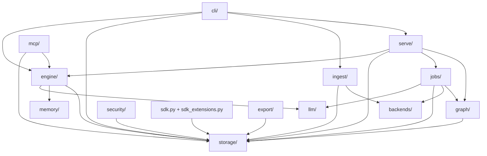
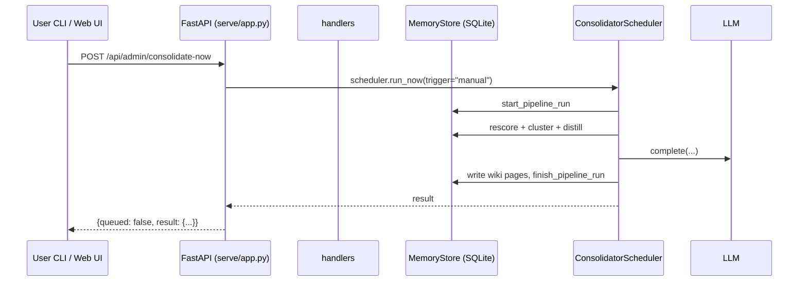

# Architecture

A short map of the codebase so new contributors (and future you) can find their
way around without grepping 8,000 lines of Python.

## Layered view

## Subpackage responsibilities

- **`engine/`** — the core loop. `LoopEngine` drives a turn (read short-term,
  decide what to remember, write to long-term). Pure logic; talks to LLM and
  embedder only.
- **`memory/`** — dataclasses for `MemoryItem`, `WikiPage`, `Entity`, etc. The
  vocabulary of the system.
- **`storage/`** — `MemoryStore`: SQLite-backed persistence. Single source of
  truth for sessions, memories, entities, relations, wiki pages, settings,
  pipeline runs, signals.
- **`backends/`** — pluggable embedders (hashing, sentence-transformers) and
  vector stores (in-memory, Chroma).
- **`llm/`** — `LLMClient` protocol + providers (OpenAI-compatible, Anthropic,
  Ollama, rule-based fallback) and a validated `default_config()` shape.
- **`ingest/`** — convert external transcript formats (Codex, Claude, Hermes,
  generic JSONL) into the common `IngestedSession` and run them through the
  `MemoryPipeline`.
- **`jobs/`** — background work. `Consolidator` (rescore + gc + dedupe),
  `LLMConsolidator` (LLM-driven cleanup), `EvolutionConsolidator` (5-stage
  pipeline), `ConsolidatorScheduler` (APScheduler-based runner), plus v7
  semantic graph scoring and cognitive sleep cleanup.
- **`graph/`** — entity/relation extraction and the read-side `KnowledgeGraph`.
- **`serve/`** — FastAPI app and helpers. `app.create_app()` wires ~40 routes
  to handlers in `handlers.py`. `watcher.py` polls the filesystem for new
  transcripts.
- **`cli/`** — `main.main(argv)` is a 1-line dispatcher; each subcommand lives
  in `cli/commands/` (read / write / serve / hooks / graph / cognitive). The
  positional `export <dir>` form writes a v7 bundle; the legacy `export
  --out <file> [--q <query>]` form remains available.
- **`mcp/`** — stdio MCP server exposing `recall`, `list_wiki`, `get_wiki`,
  `ask`, `inject`, memory write tools, semantic graph tools, and cognitive
  audit tools to the host LLM client.
- **`sdk.py` / `sdk_extensions.py`** — shared in-process and HTTP
  `MemoryClient` contract, namespaces, graph operations, cognitive sleep, and
  portable bundle helpers.
- **`export/`** — white-box `MEMORY.md` bundle export/import and Wiki forks.
- **`security/`** — local secret storage abstraction backed by
  `~/.loop_memory/secrets.json` with mode `0600`.
- **`examples/`** — `demo.py` end-to-end smoke test used by CI.

## The 5-stage evolution pipeline

`jobs.evolution.EvolutionConsolidator` runs the dashboard's main visual loop:

1. **Stage 1 — Signal-Aware Scoring**: blend importance with recall_count and
   feedback, so "what the user actually uses" floats up.
2. **Stage 2 — Semantic Batching**: greedy cosine clustering into ≤
   `CLUSTER_MAX` buckets (fallback: hashed embeddings).
3. **Stage 3 — Per-Cluster Distillation**: ask the LLM for a 1-sentence
   summary, refined importance, and a keep / drop / rewrite plan.
4. **Stage 4 — Hierarchical Wiki Synthesis**: roll cluster summaries into
   user-profile dimensions (preferences / decisions / projects / domain /
   feedback), merging with existing wiki pages by slug.
5. **Stage 5 — Evolution Memo**: persist what changed so the next run can
   re-prompt with the user's evolving preferences.

The rule-based synthesizer is the safety net: if the LLM is missing or
returns junk, the dashboard still shows real wiki content (with topic-aware
slugs and recorded evidence_ids for drill-down).

## Request lifecycle

## Configuration & secrets

- All persistent settings live in the SQLite `settings` table.
- API keys **never** land in that table — they're stored in the local
  `~/.loop_memory/secrets.json` file with mode `0600`, under a per-provider
  account name (`llm/<provider>/api_key`).
- The settings blob carries only `api_key_set: bool` + `api_key_account: str`
  as hints, so the UI can render a "key configured" badge without leaking
  the secret to disk.
- `validate_config()` is the single source of truth for clamping
  `temperature`, `max_output_tokens`, `batch_size`, etc.

## Testing

- 315 tests across 22 files (all run via `pytest -q`).
- New code should ship with at least one focused unit test in `tests/`.
- CI (`.github/workflows/tests.yml`) runs ruff + mypy (advisory) + pytest
  with a 60% coverage floor.
